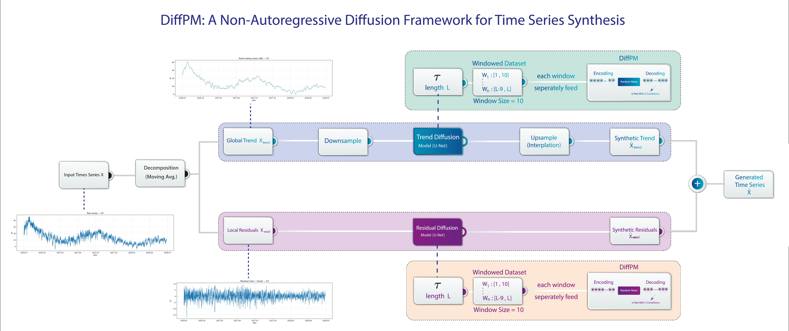

# DiffPM: Diffusion-based Time Series Generation



Official implementation of DiffPM as described in the paper. DiffPM learns to generate multivariate time series with a diffusion model, using a simple decomposition strategy and an efficient overlap-add sampler to produce coherent long sequences. Please refer to the paper for the full method and ablations.


## Quick Start

Installation:

```bash
python -m venv .venv
.\.venv\Scripts\Activate
pip install -r requirements.txt
```


## Train

```python
import torch
from run_training import run_training

device = torch.device("cuda" if torch.cuda.is_available() else "cpu")

trend_model, resid_model = run_training(
    data_npy="data/sines/sines_norm_truth_24_train.npy",
    ma_window_size=2,
    window_size=24,
    time_emb_dim=128,
    base_channels=64,
    n_res_blocks=4,
    timesteps=1000,
    s=0.007,
    batch_size=128,
    epochs=50,
    lr=1e-3,
    device=device,
)
```


## Full Pipeline (Train → Generate → Denormalize and Smooth/Rescale)

Use `main_pipeline.py` to run the full pipeline end-to-end. Edit the paths at the top of the file (set `save_npy_path` to your `(N, T, D)` training data), then run:

```bash
python main_pipeline.py
```

This script will:
- Train models via `run_training` and save a checkpoint.
- Generate a full synthetic series in normalized space (`generated/full_series_norm.npy`).
- Denormalize using dataset statistics (`generated/full_series_denorm.npy`).
- Apply smoothing and rescaling, and save the final result to `generated/full_series_denorm_smoothed_rescaled.npy`.


## Evaluate

Open the notebooks in `evaluation/` and set the paths:

- `evaluation/predictive_score.ipynb`
- `evaluation/correlation_metric.ipynb`
- `evaluation/context_fid_metric.ipynb`
- `evaluation/tsne-pca-visualization.ipynb`


## Ablation

Ablation experiments are provided in the `ablation/` folder.


